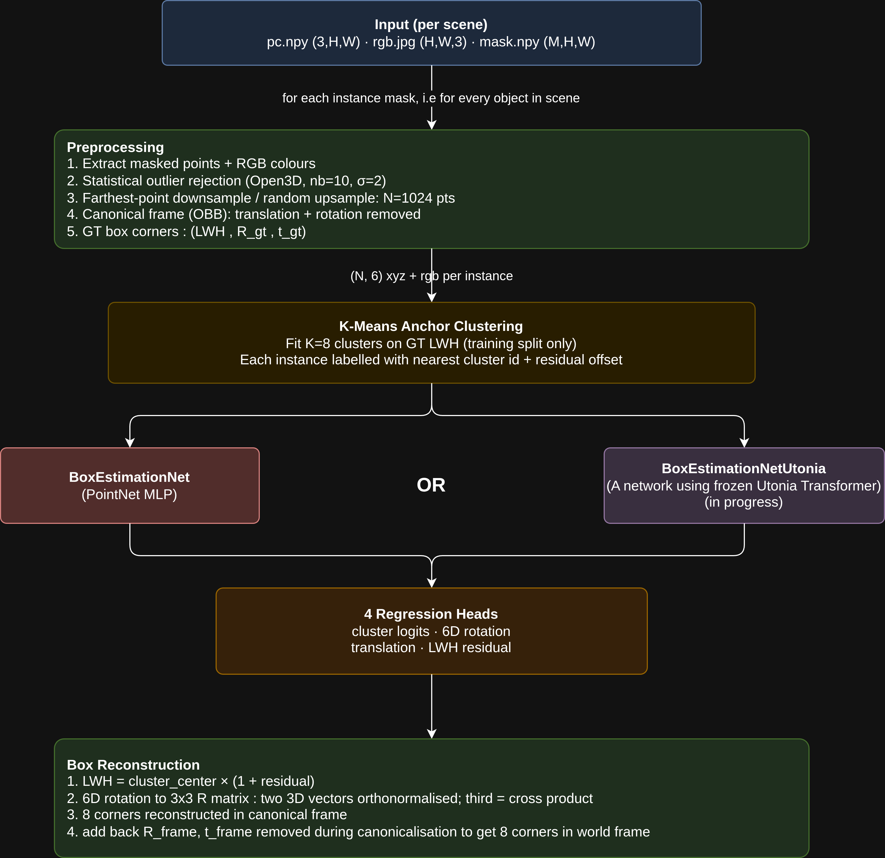
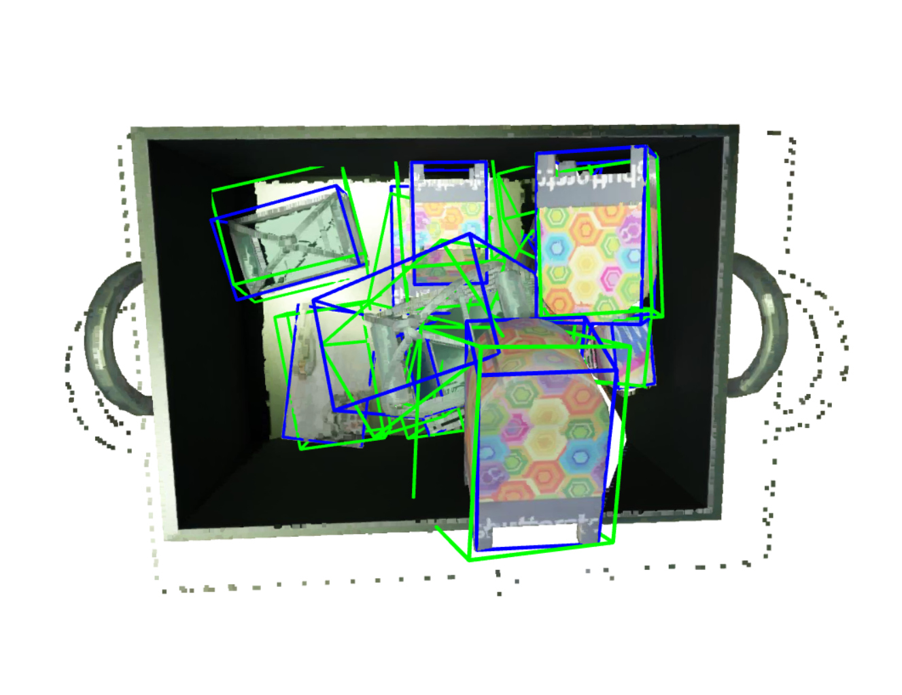
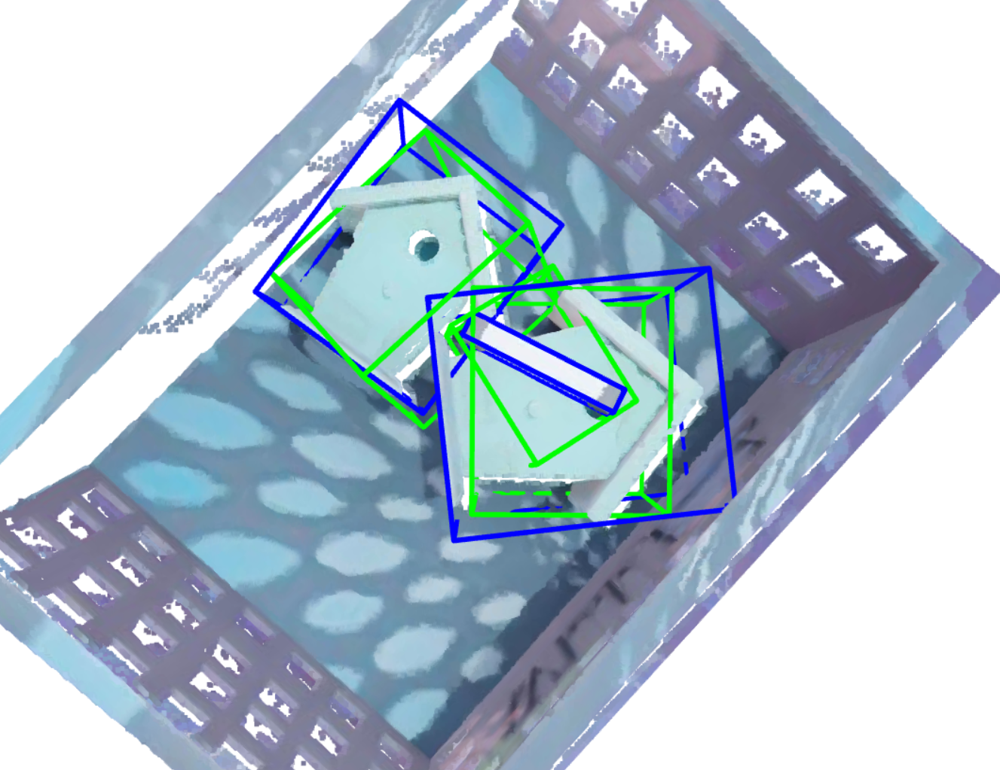
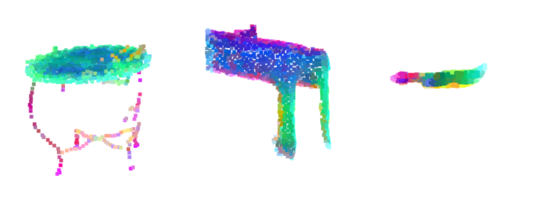

# 3D Bounding Box Estimation

Anchor-based method for predicting 3D bounding boxes given an instance segmentation mask, RGB image and point cloud. Achieves a 3D IoU of 40.5% and a mean corner distance of 26.8cm.

Inspired by [Frustum PointNets for 3D Object Detection from RGB-D Data](https://arxiv.org/abs/1711.08488).

---

## Pipeline Overview



## Architecture & Design Decisions

### 1. Input Representation

Raw data is a 3-channel depth map `(3, H, W)` encoding XYZ coordinates, an RGB image, and per-instance binary masks. For each object instance:

- Points are extracted at masked pixels and paired with RGB colour, giving shape `(P, 6)`.
- Statistical outlier rejection removes noise (Open3D, `nb_neighbors=10`, `std_ratio=2`).
- Points are resampled to a fixed size `N=1024` (farthest-point downsampling when `P > N`, random replacement otherwise).
- The point cloud is canonicalised: translated to the frame origin and rotated to align with principal geometry axes, which reduces rotational variance in the regression target.

#### Canonical Frame: OBB vs. PCA

OBB was chosen over PCA (`--frame obb|pca`). PCA can be used to determine the dominant axes and orientation, but the orientation error of bounding boxes produced like that were seen to be roughly ~2 times that of the bounding boxes produced by OBB bounding boxes hence the `Open3d` based OBB frame was used as canonical frame.

#### GT Box in the Canonical Frame
The canonical corners are decomposed into `gt_translation`, `gt_rotation` and `LWH` (length width and height). Axis ordering of GT bounding boxes is made consistent by finding the permutation of box edge directions that best aligns with (X, Y, Z) of the canonical frame, this ensures that the `gt_rotation` remains minimal in the canonical frame. All of this is done in the assumption that rotation estimation is difficult.

### 2. Model Backbones

#### BoxEstimationNet (`src/models/boxestimator.py`)
The model predicts on a single object pointcloud (or batches of it) rather than the whole scene.


```
pred_lwh = softmax(cluster_logits) @ kmeans_centers (LWH) * (1 + pred_residual (delta_LWH))
```

The model predicts a class for the anchor which gives the `LWH` and then the residuals from this is predicted separately.

### 3. 6D Rotation Representation

Rotations are encoded as the first two columns of a rotation matrix (6 scalars). The full `SO(3)` matrix is recovered at inference via orthonormalisation (`src/utils/rot_utils.py`).

The rotation head is initialised to output the identity matrix and the translation head is zero-initialised.

### 4. Loss Functions (`src/training/losses.py`)

| Loss | Formula | Weight | Motivation |
|------|---------|--------|------------|
| `loss_cluster` | Focal Loss (a=0.25, g=2) | 1.0 | Focal loss provides more importance to difficult classes, usefull since the clusters do not have equal counts |
| `loss_tr` | L1 loss | 1.0 | Robust to translation outliers |
| `loss_rot` | Geodesic rotation error | 1.0 | True metric on SO(3)|
| `loss_residual` | Smooth L1 (b=0.1) | 1.0 | Scale fine-tuning around cluster centre |
| `loss_corners` | Mean sum of 8 L2 corner distances | 10.0 | optimises the rotation translation and residuals together used in Frustum Pointnets |

```
total_loss = l_cluster*L_cluster + l_tr*L_tr + l_rot*L_rot
           + l_residual*L_residual + l_corner*L_corner
```

---

## Project Structure

```
3DBbox/
├── train.py                        # training + evaluation entry point
├── inference.py                    # standalone inference script
├── requirements.txt
├── environment.yml                 # conda environment
├── src/
│   ├── data/
│   │   ├── dataset.py              # BBox3DDataset, K-means fitting, DataLoader
│   │   ├── preprocess.py           # canonical framing, outlier rejection, resampling
│   │   └── splits.py              # 80/10/10 deterministic train/val/test split
│   ├── models/
│   │   ├── boxestimator.py         # PointNet-style backbone
│   │   └── boxestimator_utonia.py  # Utonia transformer backbone
│   ├── training/
│   │   ├── trainer.py              # training loop, checkpointing, W&B logging
│   │   └── losses.py              # loss functions + LossLambda scheduler
│   ├── eval/
│   │   ├── evaluator.py            # evaluation loop
│   │   └── metrics.py             # 3D IoU (OBB convex-hull), corner distance
│   ├── inference/
│   │   └── pipeline.py            # BoxPredictor: end-to-end inference + Open3D viz
│   └── utils/
│       ├── box_utils.py            # reconstruct_bbox(), unit-cube corner template
│       └── rot_utils.py           # rot6d_to_rotmat(), rotmat_to_rot6d()
```

---

## Dataset Structure

Download and unzip the dataset so each scene is a subdirectory under `dataset/`:

```
dataset/
├── scene_0001/
│   ├── pc.npy        # (3, H, W) float32 -- XYZ point cloud (depth map format)
│   ├── rgb.jpg       # (H, W, 3) uint8 -- colour image
│   ├── mask.npy      # (M, H, W) bool -- M instance segmentation masks
│   └── bbox3d.npy    # (M, 8, 3) float32 -- 3D box corners per instance
├── scene_0002/
│   └── ...
```

The 80/10/10 train/val/test split is generated by `src/data/splits.py`.

---

## Setup

```bash
conda create --name bbox3d python=3.12
conda activate bbox3d
pip install -r requirements.txt 
```

note - [Utonia](https://github.com/Pointcept/Utonia) requires additional requirements and must be installed as a package from its own repo.

---

## Training

```bash
# PointNet backbone (default, fast)
python train.py --model pointnet --epochs 400 --batch_size 32 --frame obb
```

| Argument | Default | Description |
|----------|---------|-------------|
| `--model` | `pointnet` | `pointnet` or `utonia` |
| `--epochs` | `400` | training epochs |
| `--batch_size` | `32` | batch size |
| `--frame` | `obb` | canonical frame: `obb` or `pca` |
| `--num_points` | `1024` | points per instance cloud |
| `--num_clusters` | `8` | K-means anchor count |
| `--kmeans_path` | `kmeans_centers.npy` | path to save cluster centres |
| `--suffix` | `""` | appended to run name and checkpoint dir |

Checkpoints are saved to `ckpt_N{N}_M{model}_F{frame}_EP{epochs}_B{bs}_K{K}/`:
- `checkpoint_epoch_best.pth` — best validation 3D IoU
- `checkpoint_epoch_last.pth` — final epoch

W&B experiment tracking is on by default (`WANDB_MODE=disabled` to turn off).

---

## Evaluation

Evaluation runs automatically at the end of `train.py` using the best checkpoint. To evaluate a saved checkpoint standalone:

```python
from src.eval.evaluator import Evaluator
from src.models.boxestimator import BoxEstimationNet
import torch

ckpt_path = "path/to/checkpoint_epoch_best.pth"
ckpt = torch.load(ckpt_path, map_location="cpu", weights_only=False)
kmeans_centers = ckpt["kmeans_centers"]

model = BoxEstimationNet(in_channels=6, num_clusters=kmeans_centers.shape[0])
evaluator = Evaluator(model, ckpt_path, testloader)
results = evaluator.evaluate()
```

### Metrics

- **Mean 3D IoU** — IoU for oriented bounding boxes, computed via convex-hull of candidate intersection points.
- **Mean Corner Distance (MCD)** — average L2 distance between corresponding predicted and GT corners, in centimetres.

---

## Inference
To run batched inference on a scene use the following script.

```bash
python inference.py \
    --checkpoint ckpt_N1024_Mpointnet_Fobb_EP400_B32_K8/checkpoint_epoch_best.pth \
    --pc dataset/scene_0001/pc.npy \
    --rgb dataset/scene_0001/rgb.jpg \
    --mask dataset/scene_0001/mask.npy \
    --visualize
```

Or from Python:

```python
import torch, numpy as np
from src.models.boxestimator import BoxEstimationNet
from src.inference.pipeline import BoxPredictor

ckpt = torch.load("path/to/checkpoint_epoch_best.pth", map_location="cpu", weights_only=False)
kmeans_centers = ckpt["kmeans_centers"]

model = BoxEstimationNet(in_channels=6, num_clusters=kmeans_centers.shape[0])
model.load_state_dict(ckpt["model_state_dict"])

predictor = BoxPredictor(model=model, kmeans_centers=kmeans_centers, device="cuda")

# returns (M, 8, 3) array of box corners in world frame
boxes = predictor("scene/pc.npy", "scene/rgb.jpg", "scene/mask.npy")

# open3d visualisation: green = predicted, red = proposed OBB(this is the canonical frame), blue = GT
predictor.visualise_result(np.load("scene/bbox3d.npy"))
```

---


## Results

| Model | Backbone | Frame | Epochs | Mean 3D IoU | Mean Corner Dist (cm) |
|-------|----------|-------|--------|-------------|----------------------|
| BoxEstimationNet | PointNet MLP | OBB | 300 | 40.5% | 26.8 |

### Training and validation curves

| Cluster classification | Residual | Corner loss |
|---|---|---|
|  |  |  |

| Rotation loss | Translation loss | IoU |
|---|---|---|
|  |  |  |

It can be seen that almost all the losses go down, except for the rotation loss it remains at ~0.30, which is the average geodesic rotiation error of objects in canonical frame. This shows that the model is not capable of learning rotation easily. 

To counter this geodesic loss, was replaced with  L2 loss and L1 loss directly on the 6D rotation vector but the loss did not improve. I believe this to be a primary reason for the low IoU.

### Inference results

Green boxes are predicted, blue boxes are GT.

| | |
|---|---|
|  |  |

---

## Future Work

- ONNX / TensorRT export for deployment. This should be rather easy for the proposed network that does not contain any special operations. 


- [Utonia](https://github.com/Pointcept/Utonia) based architecture (`src/models/boxestimator_utonia.py`): Utonia is a point cloud foundation model pre-trained on large-scale 3D data. The backbone produces rich 1224-d per-point features which is especially useful in low-data conditions where a small dataset alone cannot teach such representations. The PCA-compressed features visualised as RGB below show that Utonia has a good semantic understanding of objects which can be used for downstream tasks. I performed some initial tests with unoptimized hyperparameters with a result of ~40% IoU but since the training time is much longer I have not yet tested the model much.

  


- Explore architecture changes that could help improve on the rotation error. The problem with learning rotation is fundamental and was seen with multiple architectural changes and loss representations. This has to be explored more. 


